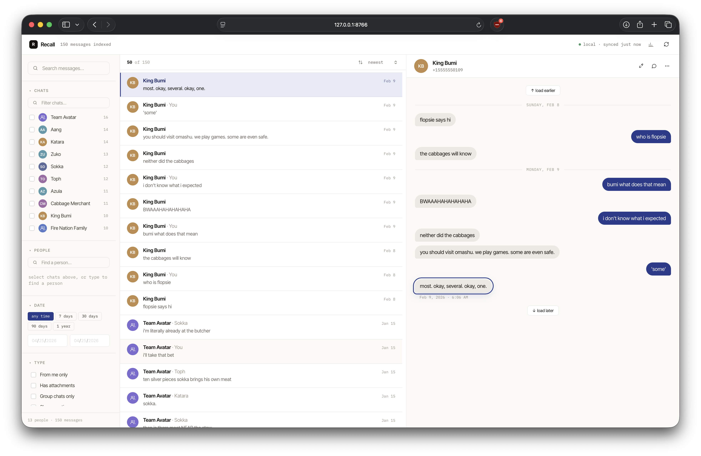
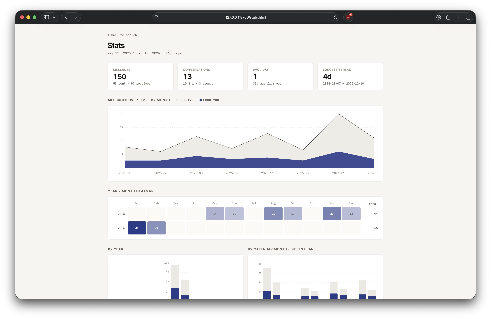

# Recall

Better search over your local iMessage history. macOS's built-in Messages search is one search bar with no filters — fine for needles you remember exactly, terrible for everything else. **Recall** indexes your `chat.db` into a faceted search UI with date/person/attachment filters, a stats dashboard, and a JSON API.



100% local. No data leaves your machine. The backend is stdlib Python (no `pip install`); the frontend is single-file React loaded from a CDN.

## Features

- **Full-text search** across every message via SQLite FTS5 (~10 ms over 325k messages)
- **Faceted filters** — chat, person, date range, has-attachment, group/1:1, from-me. Live counts refine as you filter.
- **Merged contacts** — same person across phone + email collapses into one entry; group chats stay distinct
- **Conversation pane** with matched-bubble outline, day dividers, load-earlier/load-later, hover timestamps, inline images (HEIC transcoded on the fly), iCloud-pull prompt for not-yet-downloaded attachments
- **Stats** — overview tiles, monthly timeline, year × month heatmap, hour/weekday distribution, longest streak, most-active conversations, "you talk into the void" / "they talk you nod" lopsided lists, busiest single days
- **Open in Messages.app** — jump from a hit to the live thread to scroll for context or trigger an iCloud attachment pull
- **JSON API** — every UI query is a documented endpoint, useful if you want to script your own queries

## Demo

You can boot a self-contained demo with fake data — no real `chat.db` needed:

```sh
python3 demo/build_demo.py
RECALL_CHAT_DB=demo/chat.db RECALL_INDEX_DB=demo/index.db \
  python3 -m recall.cli serve --port 8766
```

Then open http://127.0.0.1:8766. The screenshots in this README come from that demo.

## Stats

Overview tiles, monthly timeline (you vs received), year × month heatmap for seasonality, hour/weekday distributions, longest streak, most-active conversations, "you talk into the void" / "they talk you nod" lopsided ratios, busiest single days with a sent/received/both toggle. All paginated.



## Setup

1. Grant Full Disk Access to your terminal (or to Claude.app / iTerm / etc.) in **System Settings → Privacy & Security → Full Disk Access**. We read `~/Library/Messages/chat.db` directly (read-only).
2. Launch:
   ```sh
   ./launch.sh
   ```
   Reindexes from `~/Library/Messages/chat.db`, starts the server on port 8765, and opens your browser.

   Flags: `./launch.sh 9000` for a different port; `./launch.sh --no-index` to skip the (incremental, ~1s) reindex; `./launch.sh --demo` to run against the fictional ATLA dataset.

That's it. No `pip install`, no virtual env. Just stdlib Python ≥ 3.11 (which ships with macOS). The CLI breakdown if you want it raw:

```sh
python3 -m recall.cli index          # rebuild/refresh the index
python3 -m recall.cli serve          # JSON API + frontend on http://127.0.0.1:8765
```

## CLI

Same backend, scripted. Use `--json` for machine-readable output.

```sh
# Build / refresh the index
python3 -m recall.cli index                  # incremental
python3 -m recall.cli index --reset           # rebuild from scratch
python3 -m recall.cli contacts                # refresh names from Contacts.app

# Search
python3 -m recall.cli search "dinner reservation"
python3 -m recall.cli search "coffee" --contact "stephen"
python3 -m recall.cli search "" --since 2025-09-01 --until 2025-10-01 --from-me
python3 -m recall.cli search "lisbon" --attachments --no-from-me --order newest
python3 -m recall.cli search "" --chat-id 1013 --order oldest --limit 10

# Browse
python3 -m recall.cli chats                   # ranked by recency
python3 -m recall.cli handles                 # ranked by message count
python3 -m recall.cli context 327237          # surrounding messages

# JSON API for the frontend
python3 -m recall.cli serve --port 8765
```

## API

All JSON, CORS open, localhost only.

| Endpoint | What it does |
| --- | --- |
| `GET /search?q=&handles=&chat_id=&since=&until=&is_from_me=&has_attachments=&is_group=&include_reactions=&order=&limit=&offset=&with_facets=` | Full-text + filters; optional `facets.by_chat` aggregation |
| `GET /messages/{rowid}/context?before=&after=` | Surrounding messages in the same chat (incl. attachments) |
| `GET /chats?limit=` | All chats with message counts |
| `GET /people?limit=` | 1:1 chats merged across handles + groups |
| `GET /chat-members?chat_ids=1,2,3` | Participants in given chats (incl. virtual `__me__`) |
| `GET /handle-search?q=` | Lookup by contact name or handle string |
| `GET /handles?limit=` | All handles with message counts |
| `GET /attachment/{att_rowid}` | Stream the file (HEIC → JPEG transcoded) |
| `GET /stats` | Overview + all stat sections |
| `GET /stats/{top-chats,lopsided,busiest-days,longest}?limit=&offset=&mode=` | Paginated sub-sections |
| `POST /reindex` | Pull new messages from `chat.db` and refresh contacts |
| `POST /open-chat` body `{chat_identifier}` | Open Messages.app to that chat |

A search hit looks like:

```json
{
  "rowid": 327237,
  "chat_rowid": 1,
  "chat_name": "Mira Chen",
  "is_group": false,
  "handle": "+15555550142",
  "sender_name": "Mira Chen",
  "is_from_me": false,
  "date_unix": 1745533467.0,
  "date_iso": "2026-04-24T22:24:27+00:00",
  "text": "okay so dinner got moved to 8:15. is that still ok?",
  "snippet": "okay so <<dinner>> got moved to 8:15. is that still ok?",
  "has_attachments": false,
  "is_reaction": false,
  "service": "iMessage",
  "attachments": null
}
```

## How it works

We read `~/Library/Messages/chat.db` (pristine, read-only via `mode=ro`) and maintain a derived `data/index.db` next to it. The derived DB has a flat `messages` table with the columns we actually query, plus an FTS5 virtual table over the body, plus normalized chats and handles, plus a `contact_names` table populated from macOS Contacts.app, plus a per-chat `resolved_name` so 1:1 chats display as "Aang" instead of "+15555550101".

Two non-obvious wrinkles handled in the indexer:

- On macOS Ventura+ the `message.text` column is often `NULL`. The actual text lives in `attributedBody` as an NSAttributedString serialized via Apple's `streamtyped` format. We parse it ([typedstream.py](recall/typedstream.py)) — works on >99% of normal messages.
- iMessage tapbacks (👍 ❤️ 😂) are full message rows with `associated_message_type >= 1000`. We flag them as `is_reaction = 1` and hide them by default — you can toggle them back on in the sidebar.

Reindexing is incremental: we track `last_message_rowid` in a `meta` table and only pull rows past it, then run `ANALYZE` so the query planner picks the right indexes for FTS+JOIN paths (this dropped search from 17s → 24ms after the schema added contact joins).

## Project layout

```
recall/
  db.py            sqlite connections + Mac↔Unix time conversion
  typedstream.py   decoder for the attributedBody blob
  contacts.py      reader for the macOS Contacts databases
  indexer.py       chat.db → index.db, incremental, with ANALYZE
  search.py        query API: search, context window, list_people, chat_members, …
  stats.py         aggregate queries powering /stats
  api.py           stdlib JSON HTTP server + static file server
  cli.py           argparse entry — index/contacts/search/context/chats/handles/serve
web/
  index.html       faceted-sidebar React UI (single file, CDN React + Babel)
  stats.html       stats dashboard
  styles.css       shared design system (Inter Tight + IBM Plex Mono, indigo accent)
demo/
  build_demo.py    generates a fictional chat.db for screenshots / dev
data/              gitignored — index.db lives here (chat.db read from ~/Library/...)
```

## Privacy

- All processing is local. Nothing is uploaded anywhere.
- `data/` is gitignored.
- `index.db` is a derived copy of your messages — treat it like the original.
- The HTTP server binds to `127.0.0.1` by default.
- The `/attachment/{rowid}` endpoint serves files from `~/Library/Messages/Attachments/`. It's localhost-only but be mindful before exposing the server.

## Credits

Frontend designed in [Claude Design](https://claude.ai/design); backend + integration in Claude Code.
